-------[Inicio/Home](./../index.html)-------[Posts-Guias-Por-Fecha-Publicación](./../posts.html)-------[Posts-Guias-Por-Categorias](./../categorias.html)-------[Links](./../links.html)-------

## Bitwarden

Bitwarden es un gestor de contraseñas(pasword manager).

Se puede utilizar via web y la instalación en el servidor es mediante docker , pero tenemos 2 opciones.

Instalar docker y descargar y configurar las imagenes. O podemos utilizar la guia de instalacion de Bitwarden

[link-github-bitwarden](https://github.com/bitwarden/server)

Prerrequisitos:

- por lo menos 4GB RAM +

Se requiere instalacion de docker [link-docker](https://docs.docker.com/engine/install/)

y docker-compose  [link-docker-compose](https://docs.docker.com/compose/install/)

Podemos instalar desde 2 urls github o docu bitwarden

[github](https://github.com/bitwarden/server)

[docu-bitwarden](https://bitwarden.com/help/article/install-on-premise/)

En mi caso github , apartado linux & mac , ya que voy a instalar en centOS7

Descargamos el fichero

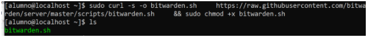

iniciamos el fichero como root
sudo ./bitwarden.sh install

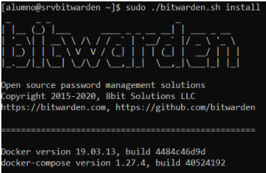

Nos preguntará por nombredominio(fqdn) o ip:
También por si queremos usar lets encrypt , en este caso No.

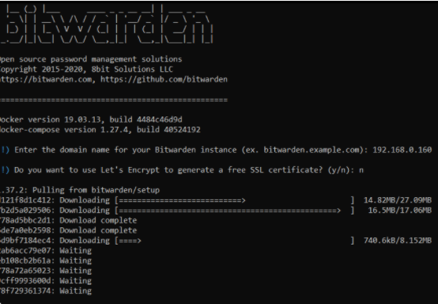

Nos preguntara por un id de instalación debemos de conseguir de [link-bitwarden-host](https://bitwarden.com/host/)

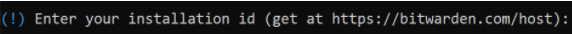

ponemos el link para que nos de un link.

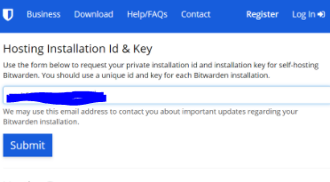

conseguimos nuestro id

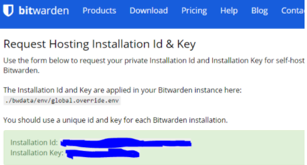

Metemos el id y la key , y nos preguntará por si queremos usar un certificado SSL propio , en este caso no , pero también podremos conf en el docker que corramos más adelante igualmente.

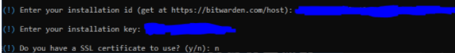

Incluso nos preguntará si queremos generar un certificado autofirmado para utilizarlo , le decimos que no.
Como he comentado , más adelante podemos nosotros mismos generarlo y configurarlo.
aviso , si no tenemos certificado SSL instalado , debemos instalar si o si ya que después de configurar smtp en fichero de configuración , al crear la cuenta , tendremos problemas para crear una cuenta y no se creará. Se puede ver el log para comprobar cómo al intentar crear cuenta no está importando mediante clave id , la nueva cuenta.(podemos utilizar un servidor local smtp , en mi caso al no tenerlo , he utilizado el servidor smtp de google.)

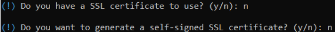

Comienza la instalación y acabará. Podemos comenzar a correr bitwarden desde el script que nos ha generado.

Como podéis comprobar nos advierte que no podremos operar con bitwarden a no ser que no tengamos certificado SSL.

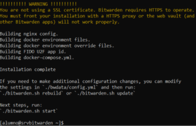

Cuando comenzamos con un start bitwarden , si no tiene la imagenes por primera vez de docker descargadas , la descarga y comienza hacer un pull de descarga de ellas . Después se levantan los contenedores.

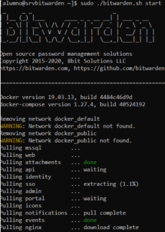

Por último sale un mensaje , el cual bitwarden está corriendo.

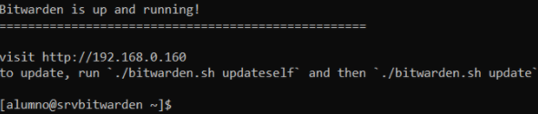

He tenido un problema en la ver. 1.37 de bit warden. 
Al levantar y comenzar con el script en start, compruebo los contenedores → ‘sudo docker ps -a’ y Nginx no levanta.
Al comprobar logs de nginx → ‘sudo docker logs bitwarden-nginx’
Me doy cuenta que hay una línea que comenta address family not supported by protocol
Encuentro que el protocolo ipv6 , yo lo tengo desactivado en el kernel , y por tanto no puede nginx utilizar este protocolo y tiene errores.

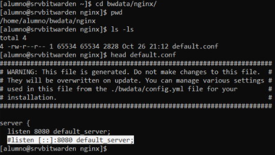

comprobamos contenedores(tarda bastante en levantar).

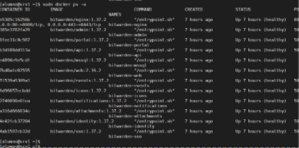

Ya tenemos servicio desde la web

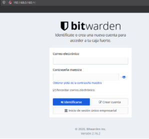

Ahora debemos configurar el fichero de configuración en 

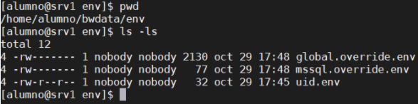

Configuramos smtp para bitwarden

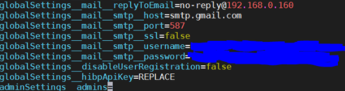

realizamos un rebuild para aplicar la configuración

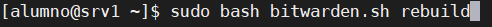

Y arrancamos de nuevo bitwarden

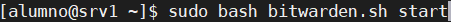

Creamos una cuenta

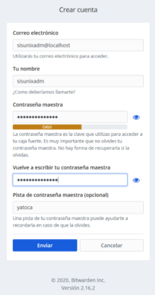

TIP La cuenta no se creara en ningún momento , si no tenemos conf el servidor web Bitwarden mediante SSL , para ello conviene instalar un certificado valido después de la instalación , o en la misma instalación indicar que no tenemos Certificado , y que necesitamos generar un certificado auto-selt(auto-firmado)

Comprobar el correo , aceptar y confirmar email. 

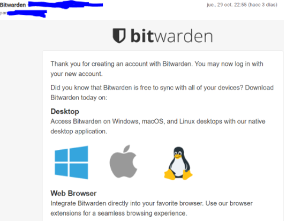

Al loguear pedirá confirmar la cuenta en el correo

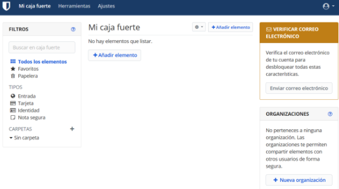

En mi caso estoy utilizando un servidor smtp de google y por tanto como en bitwarden lo tengo configurado con un correo smtp , bitwarden está enviando a las demás cuentas de correo que son el mismo id de la cuenta de bitwarden el codigo de verificacion de correo , vamos que al fin y al cabo mi cuenta de gmail hace de enviador de correos de mi servidor de bitwarden , y para otros casos , bastaría con tener un smtp local y pop o imap también montados localmente para que bitwarden utilizase una cuenta de correo del servidor smtp para enviar los correos de bitwarden a las demás cuentas de correo de la intranet (misma red local). Al fin y al cabo sería tener un servidor de correo montado localmente para no utilizar el de google , y así que el tráfico a internet no salga en ningún caso.

En caso de ser más paranoicos , podríamos cortar todo acceso a internet al servidor de bitwarden y de correo , para que en ningún momento ningún tráfico salga a internet , si se piensa que la api de bitwarden , está enviando información , fuera de nuestra red.

Aquí el correo de verificación

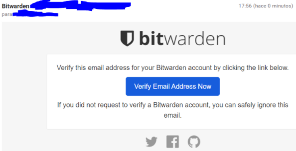

Una vez verificada podremos crear cuentas y comenzar a utilizar nuestro bitwarden como servidor password manager.

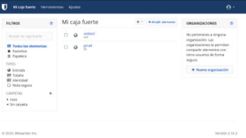

[ADMIN-portal-bitwarden-manual](https://bitwarden.com/help/article/admin-portal/)

Ahora para realizar un admin editar:

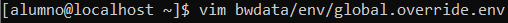

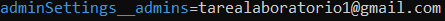

repetir:
- [x] rebuild
- [x] start
- [x] comprobar contenedores docker UP

solicitar admin

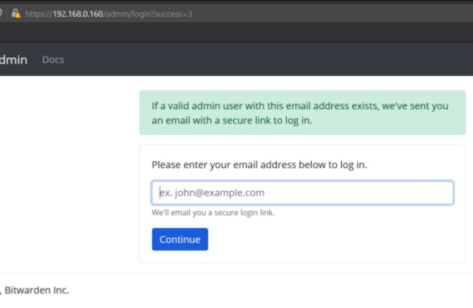

Mirar el correo o solicitar el acceso por correo cada vez para el admin.

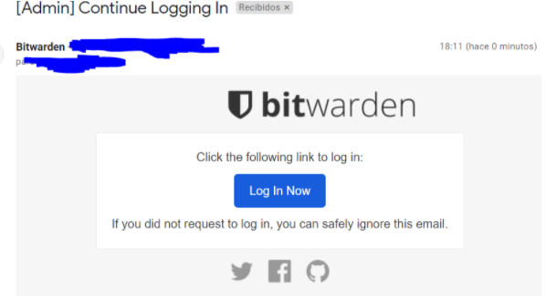

Para entrar de admin se deberá de pedir cada vez por correo con la solicitud.

El panel admin dashboard

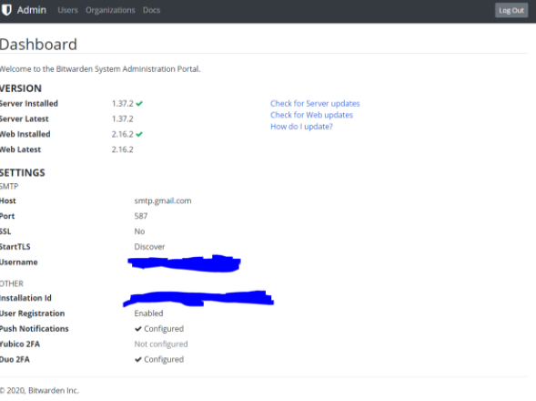

En caso de querer Poner SSL en true

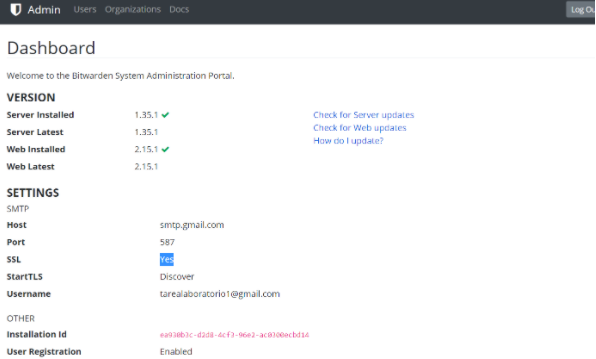

editar

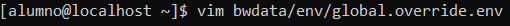

línea

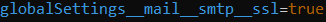

repetir:

- [x] rebuild
- [x] start
- [x] comprobar contenedores docker UP

Apartado usuarios

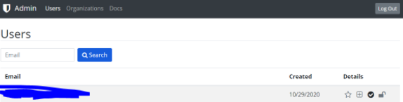

Apartado organizaciones

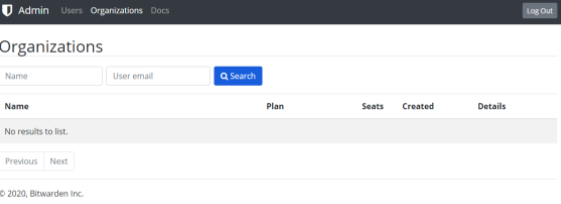

Backup bitwarden

[link-backup-bitwarden-docu](https://bitwarden.com/help/article/backup-on-premise/)

* * *

FUENTES:

[installation video local](https://www.youtube.com/watch?v=iJLxUSKo9LM)

[bitwardenmssql](https://www.reddit.com/r/Bitwarden/comments/f6yfx1/bitwardenmssql_keeps_restarting/)

[some-issues](https://github.com/bitwarden/server/issues/582)

[install-bitwarden-oficial-docu](https://bitwarden.com/help/article/install-on-premise/)

[bitwarden-github](https://github.com/bitwarden/server)

[install-docker-centos](https://docs.docker.com/engine/install/centos/)

[install-docker](https://docs.docker.com/compose/install/)

[disable-selinux](https://linuxize.com/post/how-to-disable-selinux-on-centos-8/)

[host](https://bitwarden.com/host/)

[hosting](https://bitwarden.com/help/hosting/)

[review part 1](https://www.youtube.com/watch?v=3Y8O0wyYsiQ)

[review part 2](https://www.youtube.com/watch?v=vpVVq7S6lO4)

-----------------------------------------------------------------------------

ZipyintheNet¡ 2020!®