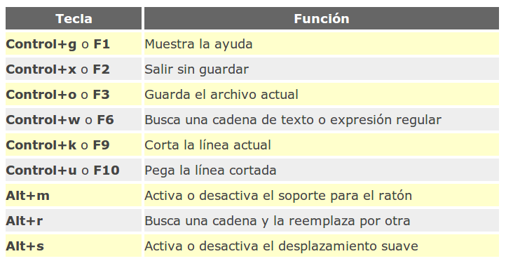

-------[Inicio/Home](./../index.html)-------[Posts-Guias-Por-Fecha-Publicación](./../posts.html)-------[Posts-Guias-Por-Categorias](./../categorias.html)-------[Links](./../links.html)-------

## Edicion de textos

Para editar textos en el shell de Linux contamos con varios programas vamos a ver dos de ellos:

**vi** o **vim**

Es un editor que puede resultar complejo de utilizar pero es muy útil si, por ejemplo, se nos ha desconfigurado el KDE o el Gnome y no podemos iniciar Linux en modo gráfico. En ese caso nuestra opción sería iniciar Linux en modo texto y utilizar el editor **vi** o **vim** para editar los ficheros correspondientes que puedan hacer que KDE o Gnome vuelvan a funcionar. Es por ello que debemos conocer su uso, aunque aquí lo veremos de una manera muy básica.

Para empezar, al ejecutar la orden **vi** o **vim** en el shell sin ningún argumento veremos que aparece un texto en pantalla en el que todas las líneas comienzan por un símbolo **~**. Ese símbolo señala que son líneas que no pertenecen al fichero que estamos editando.

El editor **vi** o **vim** dispone de 2 modos. En primer lugar tenemos el **modo** **de** **edición**, en el que todo lo que escribamos será añadido al fichero que estamos editando. El segundo modo es el **modo** **de** **comandos**, en el que las teclas que pulsemos serán interpretadas como comandos del editor. Podemos alternar entre un modo y otro mediante la tecla **ESC**.

En el modo de comandos nos podemos mover por el texto libremente mediante las flechas de dirección. Los principales comandos son:

*   **dd** borra una línea completa.
*   **i** inserta texto antes del carácter sobre el que está el cursor.
*   **a** inserta texto después del carácter sobre el que está el cursor.
*   **I** inserta texto al comienzo de la línea en la que está el cursor.
*   **A** inserta texto al final de la línea en la que está el cursor. 
*   **o** abre espacio para una nueva línea después de la línea en la que está el cursor y permite insertar texto en la nueva línea.
*   **O** análogo al anterior, pero abre espacio en la línea anterior.
*   **ESC** como hemos dicho antes, permite bandonar el modo de inclusión de texto para volver al modo de comandos; también se usa para cancelar comandos. (Usarlo en caso de duda).
*   **Ctrl-F** avanzar una pagina hacia adelante.
*   **Ctrl-B** avanzar una pagina hacia atrás.
*   **Ctrl-L** refrescar la pantalla.
*   **G** poner el cursor al final del fichero.
*   **1G** poner el cursor al principio del fichero.
*   **XG** poner el cursor en la línea X.
*   **$** poner el cursor al final de la linea.
*   **0** (cero) poner el cursor al principio de la linea.
*   **/** **texto** busca el texto en el fichero y sitúa el cursor delante de la primera coincidencia que encuentra.
*   **:set** **number** pone el número de línea de cada una.
*   **:q** salir del editor si no ha habido cambios.
*   **:q!** salir del editor sin guardar los cambios.
*   **:w** guardar los cambios.
*   **:wq** guardar los cambios y salir del editor.
*   **ZZ** guardar los cambios y salir del editor.

Como podéis ver, el editor de textos **vi** o **vim** se maneja completamente desde el teclado y, aunque pueda parecer un poco complicado de usar en un principio, es muy potente.  

**nano**  

Es un sencillo editor de textos para el terminal que viene instalado por defecto en Ubuntu. No es tan potente como Vim o Emacs pero es mucho más fácil de manejar que estos. Así cualquier usuario por poco experimentado que sea es capaz de empezar a usar Nano desde el primer momento gracias a las dos líneas de ayuda que mantiene en su parte inferior.

Para editar un archivo con Nano tenemos que ejecutar el siguiente comando: **nano** **nombre_archivo**

Nos aparecerá entonces el contenido del archivo para que podamos modificarlo con el editor. Si lo modificamos (no te preocupes que en este archivo no pasa nada si lo cambias), veremos en la parte superior derecha el texto Modificado. Para guardar los cambios, pulsaremos la combinación de teclas Control+o. Y para salir, Control+x.

Nano está pensado para ser usado con el teclado, no con el ratón, por lo que tiene asociadas multitud de acciones a combinaciones de teclas. En la siguiente tabla podemos ver algunas de las más importantes:

Sin embargo, si quieres exprimir al máximo las posibilidades de este editor, sería recomendable leer la ayuda que trae. Para ello pulsamos en cualquier momento F1 o la combinación de teclas Control+g (como se indica en la tabla anterior).

-----------------------------------------------------------------------------

ZipyintheNet¡ 2020!®