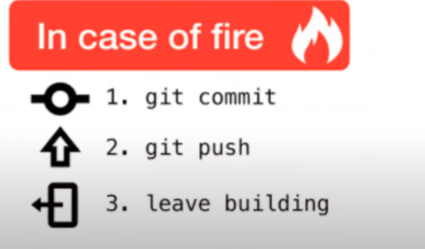

-------[Inicio/Home](./../index.html)-------[Posts-Guias-Por-Fecha-Publicación](./../posts.html)-------[Posts-Guias-Por-Categorias](./../categorias.html)-------[Links](./../links.html)-------

## Git - Parte 1

Git es un controlador de versiones para ficheros.

Uso:

Diferentes estados de tu archivo:

*   working area (momento que se está trabajando[en local?]) (escribiendo..borrando...)

*   stagin area (me gustaria guardar)
	
*   commit (guardado !)
	
*   subir repositorio remoto(github,gitlab..etc)

Meter en Stagin area(pasar de working area en local ->a stagin area[área de ensayo]):
```
   git status 
```
```
   git add x
```
```
   git status
```

Meter todo Working area -> stagin area:
```
   git add .
```

Con Commit guardamos:
```
   git commit -m “mensaje”
```

Con Push subimos a repositorio:
```
   git push
```

Histórico de commits (logs):
```
   git log
```
```
   para salir del log ‘:q!’
```

CASO DE TENER UN FUEGO al hacer Commit y Push:



-----------------------------------------------------------------------------

ZipyintheNet¡ 2020!®