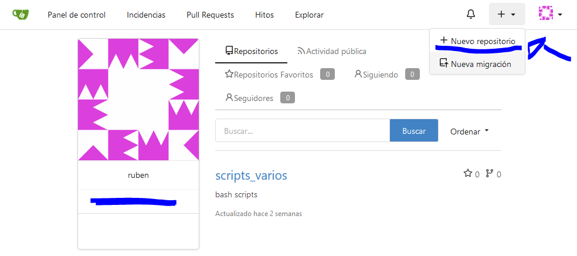
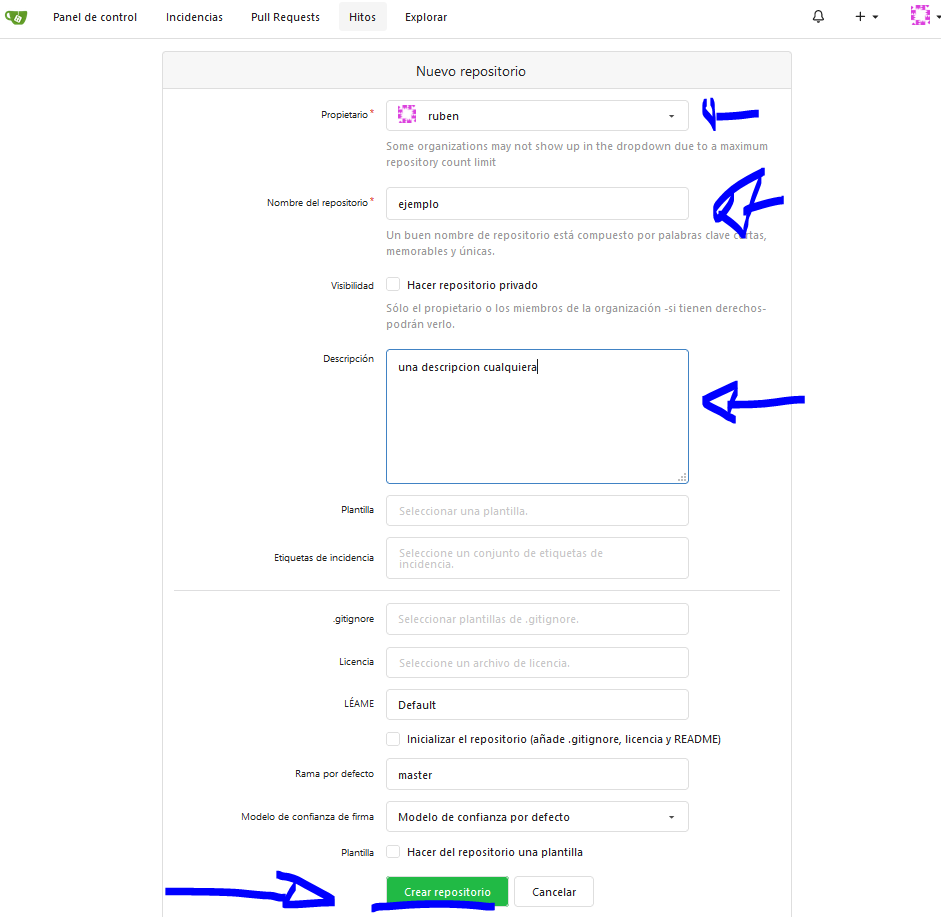
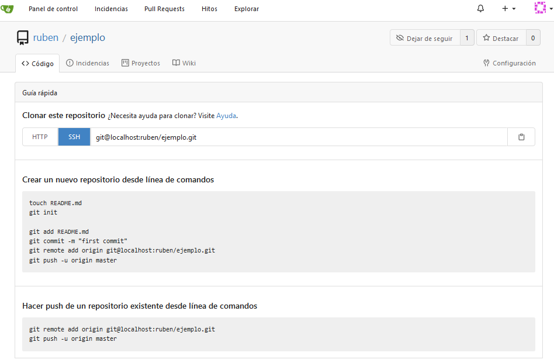
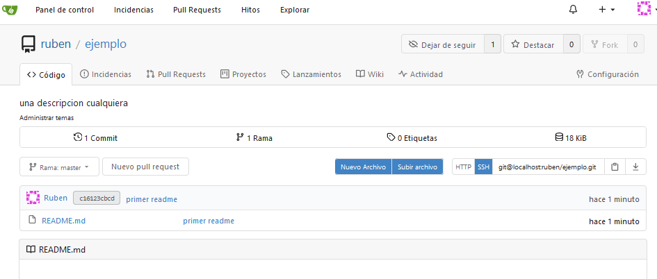

-------[Inicio/Home](./../index.html)-------[Posts-Guias-Por-Fecha-Publicación](./../posts.html)-------[Posts-Guias-Por-Categorias](./../categorias.html)-------[Links](./../links.html)-------

## Git - Parte 5

Git es un controlador de versiones para ficheros.

### CREACION REPOSITORIO EN GIT Y CLONACION REPOSITORIO 

#### CREACION REPOSITORIO EN GIT

Primero creamos un nuevo repositorio:

Abrimos desplegable para crear nuevo repositorio



Segundo damos valores al repositorio , nombre , propietario , descripcion y lo creamos



Una vez lo creamos , nos aparece esto por primera vez , una lista de pasos a realizar



#### CLONACION REPOSITORIO 

Como ya tenemos creado el repositorio pero no hay nada dentro de el. Vamos a clonarlo , para despues meter algo en el repositorio.

Para clonar via ssh, en mi caso gitea escucha mediante ssh en el puerto 222 , clono repositorio via ssh mediante puerto 222:

```
git clone ssh://git@gitea.casa:222/ruben/ejemplo.git

```

Nos comentara lo siguiente ya que esta vacio y ya lo sabemos:

```
Cloning into 'ejemplo'...
warning: You appear to have cloned an empty repository.
```

Podemos mirar que hay dentro de el repositorio:

```
ls -lsa
```

Observamos que no hay nada, solo hay oculto un directorio llamado .git que guarda los valores. 
Clonar el repositorio equivale a realizar ``` git init ``` por que al clonar ya nos trae el .git.
Podriamos realizar de otra forma el ```git remote add```  y realizar el push , pero mediante ```git clone``` , ya bajamos todo aquello que haya dentro del repositorio , de forma que lo crea el repositorio localmente tambien.

```
total 0
.
..
.git
```
Debemos realizar estas 2 partes para configurar el repositorio y poder realizar ```PUSH```
realizar parte 3 y 4

[parte3](https://zipyinthenet.github.io/posts/git3-20201219.html)

```
git config user.name "Ruben"
```

[parte4](https://zipyinthenet.github.io/posts/git4-20201219.html)

```
git config --global user.email "ruben@local.casa"
```

Una vez configurado , podemos crear un fichero markdown vacio , y añadirlo al repositorio.

```
touch README.md
```

```
git add README.md
```

```
git status
```

```
git commit -m "primer readme"
```

```
git push
```

Como podemos observar , funciona



-----------------------------------------------------------------------------

ZipyintheNet¡ 2020!®
